# Projektlabor Rheine Faceshield

This is the Repository of the faceshield developed and produced by the *Projektlabor Rheine*.
Feel free to download and cut theese on your Laser cutter.

## Interested?
**Write to sommer@pkr-projekt.de**

## Ideas?
### Post on Instagram: @projektlabor or #plshield

## Making the Faceshields:
- *Cutout's*:
   - Banana
   - Connector x2
- Velcro strap (25cm) soft
- Velcro strap (10cm) rough
- Textile Rubber belt 45cm
- Film/foil A4
- Rubber band x3
- Some Plastic Glue

**Some Pictures below**

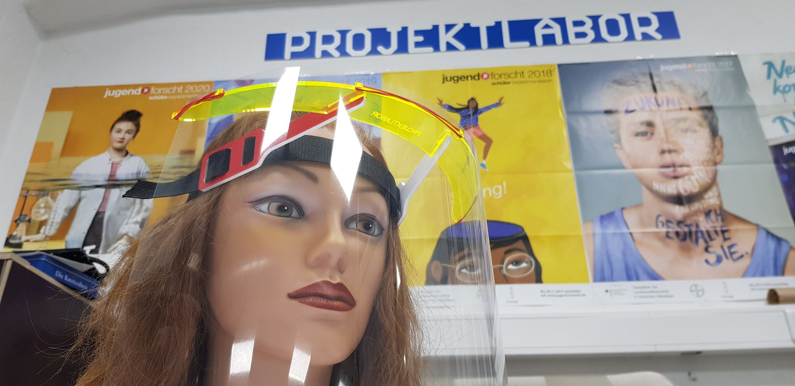

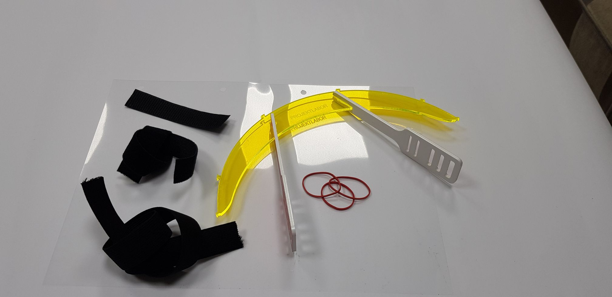
Material you need to build the shields

### Building Instructions:

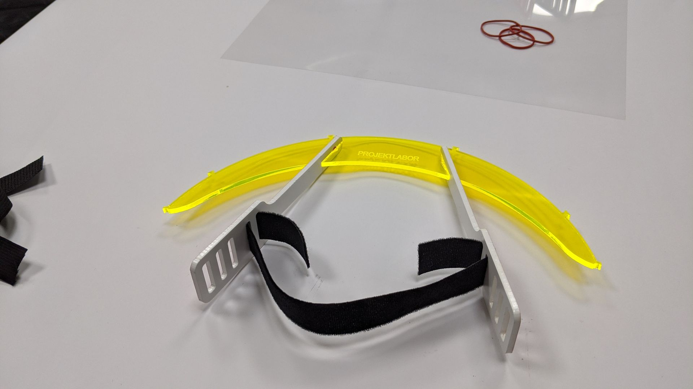
Thread soft Velcro strap into both sides of the shield frame like shown above.

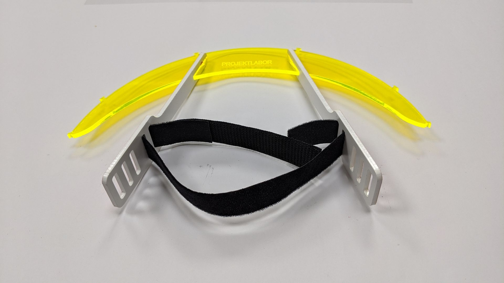
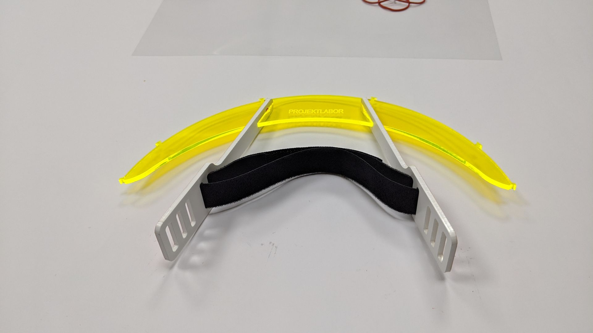
Use the rough type of Velcro strap to connect both sides

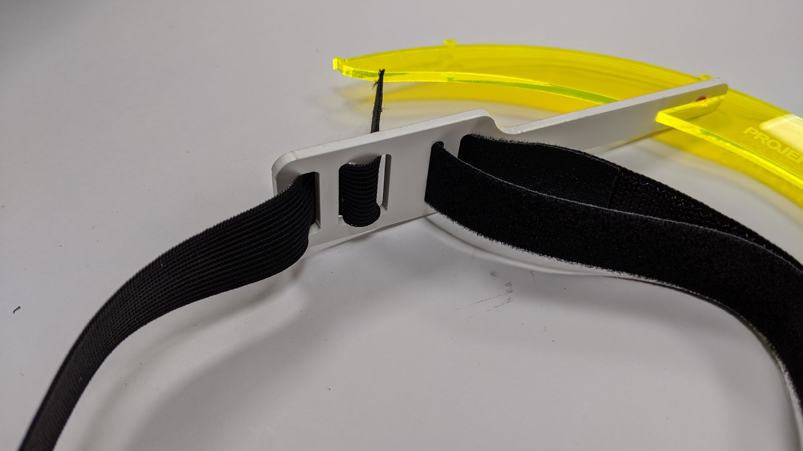
Now thread in the Textile Rubber belt like shown above.

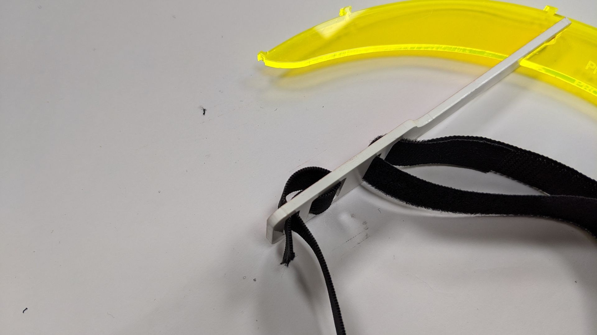
And back again to keep the belt from getting out of the frame. :)

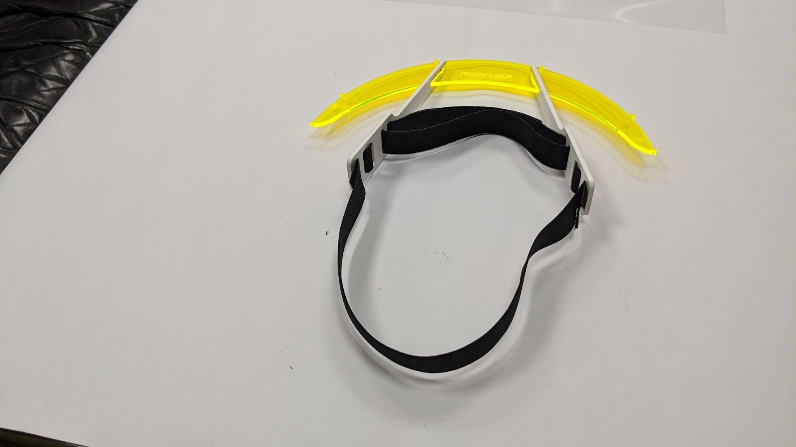
Now on the other side aswell. Almost done!

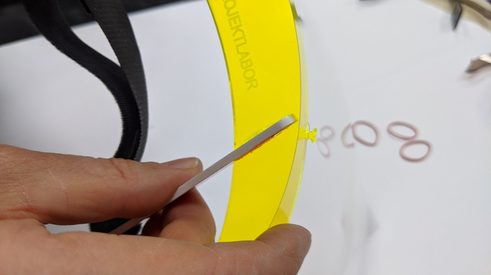
Punch 4Holes into the A4 film and put them onto the frame. 

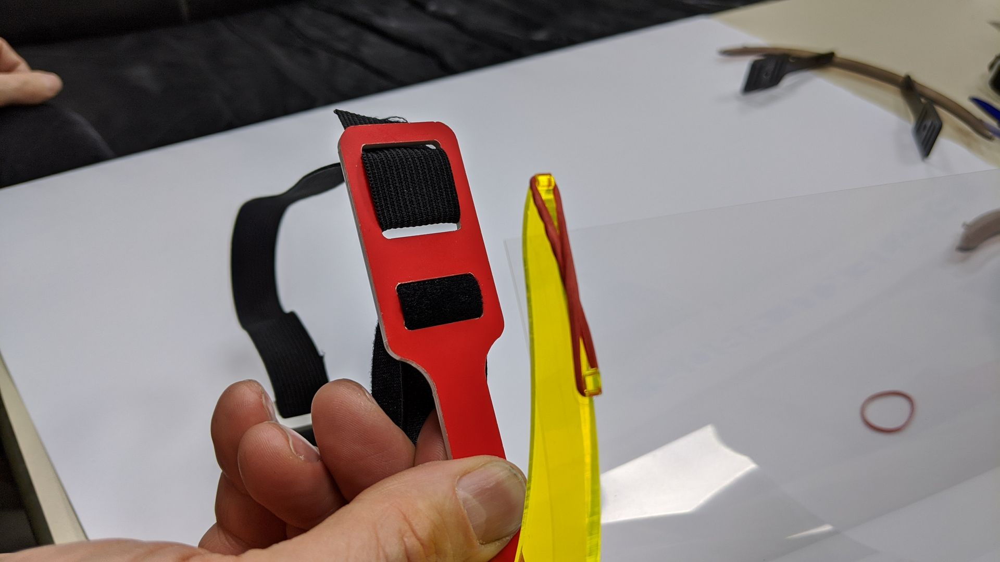
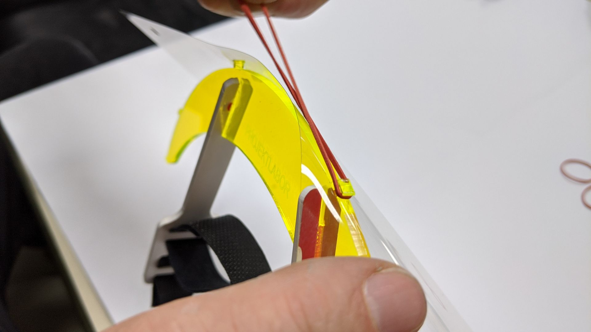
Use Rubber bands to secure the film in place

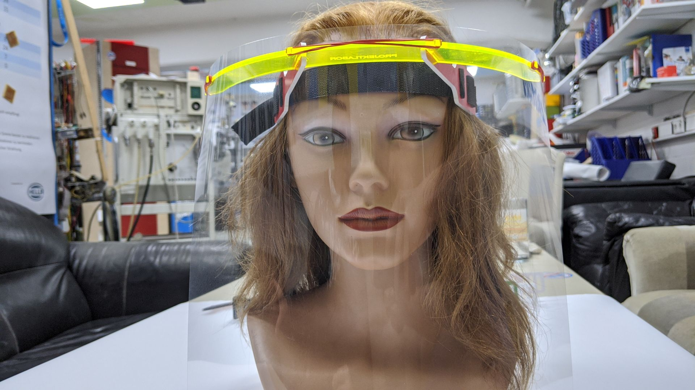
**DONE !!!**

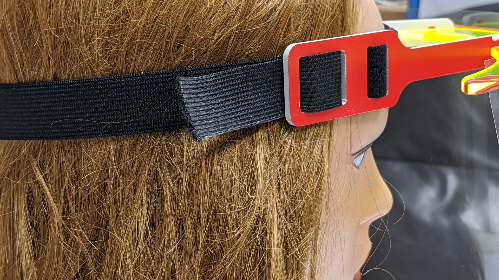
You can tighten the Rubber!

